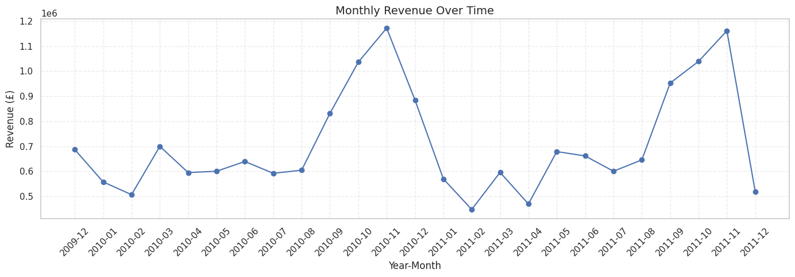
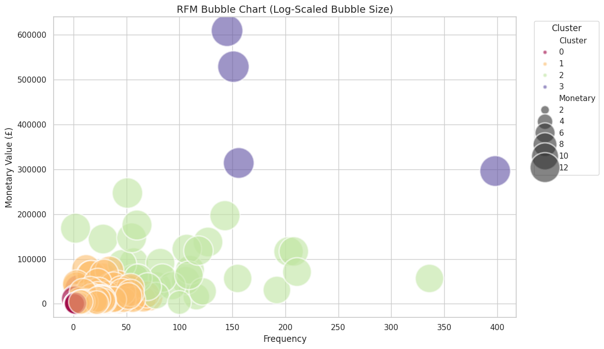
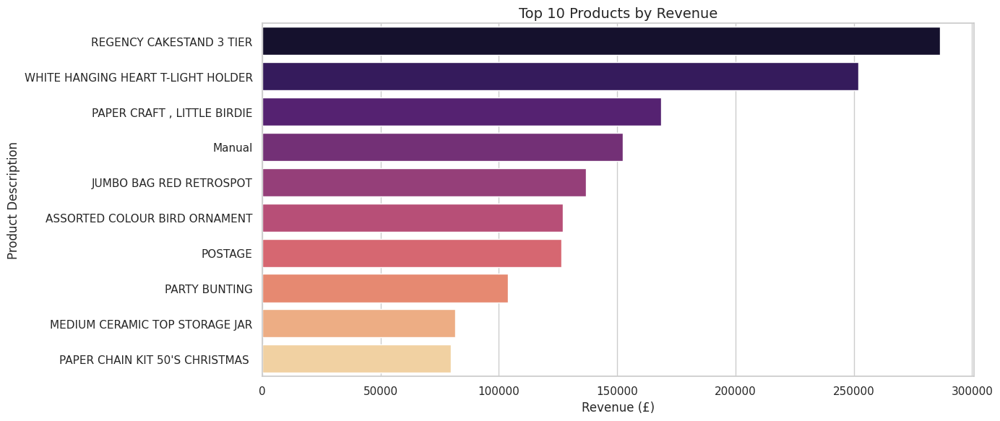
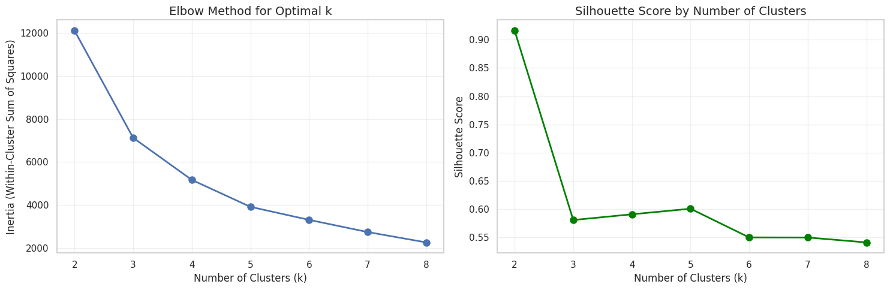

# Online Retail Analysis & Customer Segmentation

A comprehensive data analysis project examining e-commerce transactions to uncover revenue trends, customer segments, and actionable business insights using machine learning and statistical methods.

## Overview

This project analyzes the **Online Retail II dataset** from the UCI Machine Learning Repository, containing over 1 million transactions from a UK-based online retailer (2009-2011). Through RFM analysis and K-means clustering, we segment customers into actionable personas and identify strategic opportunities for business growth.

**Key Deliverables:**
- Customer segmentation using RFM analysis (4 distinct clusters)
- Revenue trend analysis and seasonality patterns
- Geographic market distribution insights
- Product performance analytics
- 90-day revenue forecasting using ARIMA

## Key Findings

### Business Metrics
- Total Revenue: £17,743,429
- Customer Base: 5,878 unique customers
- Transaction Volume: 1,067,371 records
- Geographic Reach: 38 countries

### Customer Segmentation Results

| Segment | Count | % of Base | Avg Spend | Total Revenue | Revenue % |
|---------|-------|-----------|-----------|---------------|-----------|
| Ultra VIP | 4 | 0.1% | £437K | £1.7M | 9.9% |
| High-Value | 35 | 0.6% | £83K | £2.9M | 16.4% |
| Active Regular | 3,841 | 65.3% | £3K | £11.6M | 65.4% |
| At-Risk | 1,998 | 34.0% | £765 | £1.5M | 8.5% |

**Critical Insight:** 39 customers (0.7% of base) generate £4.6M (26.3% of total revenue)

### Market Concentration
- UK: 83.0% of revenue (£14.7M) - extreme geographic concentration
- Australia: 1.0% (£170K) - largest non-UK market
- International markets: Only 17% combined, indicating expansion opportunity

### Product Analysis
- Top 10 products: 8.5% of revenue (healthy diversification)
- Leading product: REGENCY CAKESTAND 3 TIER (£286K)
- Category dominance: Home décor and gift items

## Visualizations

### Monthly Revenue Trend


### Customer Segmentation


### Top Products


### Clustering Validation


## Technology Stack

- Python 3.10+
- pandas, numpy - Data manipulation
- scikit-learn - Machine learning (K-Means clustering)
- matplotlib, seaborn - Visualizations
- plotly - Interactive maps
- pmdarima - Time series forecasting
- Jupyter Notebook - Interactive analysis

## Getting Started

### Prerequisites
- Python 3.10 or higher
- pip package manager
- Kaggle account (for dataset access)

### Installation

1. Clone the repository
   ```bash
   git clone https://github.com/itsaryanchauhan/online-retail-analysis.git
   cd online-retail-analysis
   ```

2. Install dependencies
   ```bash
   pip install -r requirements.txt
   ```

3. Configure Kaggle credentials
   ```bash
   mkdir ~/.kaggle
   mv kaggle.json ~/.kaggle/
   chmod 600 ~/.kaggle/kaggle.json
   ```

### Reproducibility

This analysis is designed for reproducible results:
- K-Means clustering uses `random_state=42` for consistent cluster assignments
- Data processing pipeline is deterministic (no random sampling)
- Same dataset and preprocessing steps will yield identical customer segments
- ARIMA forecasting may show minor variations due to optimization algorithms

To ensure identical results:
```python
import numpy as np
np.random.seed(42)  # Set before running analysis
```

### Usage

**Run complete analysis pipeline:**
```bash
python3 run_analysis.py
```

Or from the scripts directory:
```bash
cd scripts
python3 main.py
```

**Interactive Jupyter Notebook:**
```bash
jupyter notebook retail_analysis.ipynb
```

**Use individual modules:**
```python
import sys
sys.path.append('scripts')

from data_loader import load_retail_data
from rfm_analysis import calculate_rfm, segment_customers

df = load_retail_data()
rfm = calculate_rfm(df)
rfm = segment_customers(rfm, n_clusters=4)
```

## Project Structure

```
online-retail-analysis/
├── retail_analysis.ipynb   # Complete analysis notebook
├── scripts/
│   ├── data_loader.py       # Data loading utilities
│   ├── data_cleaning.py     # Preprocessing & feature engineering
│   ├── rfm_analysis.py      # Customer segmentation
│   ├── visualizations.py    # Chart generation
│   └── main.py              # Pipeline orchestrator
├── plots/                  # Generated visualizations
├── requirements.txt        # Dependencies
└── README.md              # Documentation
```

## Business Recommendations

### High Priority (0-3 months)
1. Protect high-value customers: 39 customers generate 26.3% of revenue
2. Launch Q4 marketing campaigns (September-November peak season)
3. Deploy win-back campaigns for 1,998 dormant customers

### Medium Term (3-6 months)
1. Reduce UK dependency from 83% through international expansion
2. Implement tiered loyalty program for active customers
3. Expand product portfolio beyond home décor

### Long Term (6-12 months)
1. Build predictive churn models
2. Develop subscription-based revenue streams
3. Systematic market entry into Australia, Germany, Netherlands

**Projected Impact:** £2.5M-£3.5M additional revenue (14-20% growth)

## Resources

- **Jupyter Notebook (Google Colab):** [Open in Colab](https://colab.research.google.com/drive/16FOyfSm8DRjQYX3FOyfqan5HAcHQDN5u?usp=sharing)
- **Dataset:** [Online Retail II UCI](https://www.kaggle.com/datasets/mashlyn/online-retail-ii-uci)
- **Kaggle Notebook:** [View on Kaggle](https://www.kaggle.com/code/payaryan/retail-analysis)
- **GitHub Repository:** [Source Code](https://github.com/itsaryanchauhan/online-retail-analysis)

## Results & Outputs

Running the analysis generates:

**Visualizations** (`plots/`)
- monthly_revenue.png
- top_products.png
- rfm_clusters.png
- elbow_silhouette.png

## Author

**Aryan Chauhan**  
[GitHub](https://github.com/itsaryanchauhan) | [LinkedIn](https://www.linkedin.com/in/itsaryanchauhan/)

Data Analyst specializing in customer analytics and business intelligence.

## Contributing

Contributions are welcome. Please fork the repository and submit a pull request with your improvements.

Potential enhancements:
- Cohort analysis and retention metrics
- Advanced forecasting models (Prophet, LSTM)
- Interactive dashboard (Streamlit/Dash)
- A/B testing framework

## License

This project is available under the MIT License.

## Acknowledgments

- UCI Machine Learning Repository for the dataset
- Kaggle community for data science resources
- scikit-learn, pandas, and visualization library contributors
